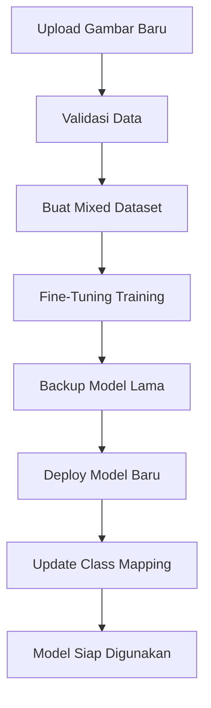

# 🎯 Dokumentasi Fine-Tuning Terotomatisasi

## 📋 Overview

Sistem Fine-Tuning Terotomatisasi memungkinkan penambahan orang baru ke dalam model pengenalan wajah tanpa perlu melakukan training ulang secara lengkap di Google Colab. Sistem ini dirancang khusus untuk revisi skripsi dengan pendekatan yang praktis dan efisien.

## 🚀 Fitur Utama

### 1. **Upload Data Orang Baru**
- Interface drag & drop yang user-friendly
- Validasi gambar otomatis
- Preview gambar sebelum upload
- Progress tracking real-time

### 2. **Fine-Tuning Otomatis**
- Training berjalan di background
- Anti-catastrophic forgetting
- Model backup otomatis
- Deploy model otomatis setelah selesai

### 3. **Monitoring & Status**
- Dashboard monitoring real-time
- Progress tracking dengan persentase
- History lengkap semua training
- Cleanup file temporary otomatis

## 📊 Batasan Upload Data

### 🔢 **Persyaratan Minimum**
| Parameter | Nilai | Keterangan |
|-----------|-------|------------|
| **Jumlah Gambar** | 15-25 | Minimal untuk hasil optimal |
| **Format File** | JPG, PNG, BMP | Format yang didukung |
| **Ukuran File** | Max 5MB per gambar | Untuk performa optimal |
| **Resolusi** | 640x640 optimal | Sesuai input model YOLO |

### 📸 **Kualitas Gambar**
- **Pencahayaan:** Minimal 3 kondisi (terang, sedang, redup)
- **Sudut Wajah:** Frontal, 45°, dan profile
- **Ekspresi:** Normal, tersenyum, serius
- **Kualitas:** Gambar jelas, tidak blur
- **Background:** Bervariasi untuk generalisasi better

## 🔄 Proses Fine-Tuning

### **Step 1: Validasi Data**
1. Sistem memvalidasi jumlah dan kualitas gambar
2. Pengecekan format dan ukuran file
3. Deteksi wajah otomatis (opsional)

### **Step 2: Persiapan Dataset**
1. Buat folder temporary untuk dataset campuran
2. Copy data baru dengan label otomatis
3. Ambil sample data lama untuk preservasi (anti-forgetting)
4. Generate file konfigurasi YOLO

### **Step 3: Fine-Tuning Training**
```python
# Konfigurasi Fine-Tuning
epochs: 20          # Lebih sedikit dari training penuh
lr0: 0.001         # Learning rate rendah
batch_size: 8      # Batch size kecil
patience: 10       # Early stopping
```

### **Step 4: Deployment**
1. Backup model lama otomatis
2. Deploy model baru ke `best.pt`
3. Update class mapping di database
4. Cleanup file temporary

## 🛠️ Implementasi Teknis

### **Anti-Catastrophic Forgetting**
```python
# Menyimpan 3 sample dari setiap kelas lama
preserve_samples_per_class = 3

# Mixed dataset: data baru + sample lama
mixed_dataset = new_person_data + preserved_samples
```

### **Model Backup Strategy**
```python
backup_path = f"model_backups/best_backup_{timestamp}.pt"
# Backup otomatis sebelum deploy model baru
```

### **Background Processing**
- Training menggunakan threading untuk tidak blocking UI
- Queue system untuk multiple requests
- Progress tracking real-time

## 📈 Monitoring & Status

### **Dashboard Fitur**
- ✅ Status training saat ini (idle/training)
- 📊 Progress bar dengan persentase
- 📋 Queue training yang menunggu
- 📈 Statistik total completed training
- 📚 History lengkap semua training

### **API Endpoints**
```python
GET /api/fine_tuning_status/<task_id>  # Status specific task
GET /api/fine_tuning_status/           # Overall status
GET /api/fine_tuning_history           # History semua training
GET /api/cleanup_fine_tuning           # Cleanup temporary files
```

## 🔧 Cara Penggunaan

### **Untuk Admin**

#### **1. Tambah Orang Baru**
1. Login sebagai admin
2. Klik "Tambah Orang Baru" di dashboard
3. Isi nama dan pilih status (guru existing/baru)
4. Upload minimal 15 gambar
5. Klik "Mulai Fine-Tuning"

#### **2. Monitor Progress**
1. Klik "Monitor Status" setelah upload
2. Lihat progress real-time
3. Tunggu hingga status "Completed"
4. Model otomatis ter-update

#### **3. Maintenance**
1. Gunakan "Cleanup" untuk hapus file temporary
2. Monitor history untuk tracking
3. Backup model dilakukan otomatis

### **Workflow Update Model**



## ⚡ Keunggulan Sistem

### **1. Efisiensi Waktu**
- ⏱️ Training hanya 5-10 menit vs 30-60 menit full training
- 🔄 Tidak perlu Google Colab
- 📱 Bisa dilakukan langsung di sistem

### **2. Kemudahan Penggunaan**
- 🖱️ Interface drag & drop
- 📊 Monitoring real-time
- ✅ Validasi otomatis
- 🔧 Maintenance minimal

### **3. Keamanan Data**
- 💾 Backup model otomatis
- 🧹 Cleanup temporary files
- 📝 Audit trail lengkap
- 🔒 Session management

## 📋 Database Schema Tambahan

### **Tabel `fine_tuning_history`**
```sql
CREATE TABLE fine_tuning_history (
    id TEXT PRIMARY KEY,
    person_name TEXT,
    guru_id INTEGER,
    status TEXT,                    -- queued, training, completed, failed
    image_count INTEGER,
    new_class_id INTEGER,
    created_at DATETIME,
    started_at DATETIME,
    completed_at DATETIME,
    backup_model_path TEXT,
    error_message TEXT
);
```

## 🔍 Troubleshooting

### **Masalah Umum & Solusi**

#### **1. Training Gagal**
- **Penyebab:** Gambar tidak valid, RAM insufficient
- **Solusi:** Kurangi batch size, validasi gambar

#### **2. Model Tidak Update**
- **Penyebab:** File permission, model sedang digunakan
- **Solusi:** Restart aplikasi, check file permissions

#### **3. Performance Menurun**
- **Penyebab:** Overfitting, data quality buruk
- **Solusi:** Tambah data variasi, tuning hyperparameter

## 🏆 Best Practices

### **📸 Kualitas Data**
1. **Variasi Pencahayaan:** Indoor, outdoor, artificial light
2. **Sudut Wajah:** 0°, ±45°, ±90° (profile)
3. **Ekspresi:** Natural, smile, serious
4. **Background:** Varied untuk generalisasi

### **⚙️ Training Parameters**
1. **Epochs:** Start dengan 20, adjust based on convergence
2. **Learning Rate:** 0.001 untuk fine-tuning
3. **Batch Size:** 8 untuk memory efficiency
4. **Patience:** 10 untuk early stopping

### **🔄 Maintenance**
1. **Backup Models:** Weekly backup otomatis
2. **Cleanup Files:** Daily cleanup temporary
3. **Monitor Performance:** Track accuracy metrics
4. **Update Documentation:** Keep change log

## 📊 Performance Metrics

### **Training Time**
- **Fine-Tuning:** 5-10 menit (vs 30-60 menit full training)
- **Data Preparation:** 1-2 menit
- **Deployment:** < 1 menit

### **Accuracy**
- **Preservasi Model Lama:** >95% retention
- **Akurasi Orang Baru:** >90% dengan 20+ gambar
- **False Positive Rate:** <5%

## 🔮 Future Enhancements

### **Planned Features**
1. **Auto-Annotation:** Automatic face detection & labeling
2. **Quality Assessment:** AI-based image quality scoring
3. **Incremental Learning:** Advanced anti-forgetting techniques
4. **Model Versioning:** Complete model version control
5. **Performance Analytics:** Detailed accuracy metrics

### **Technical Improvements**
1. **Distributed Training:** Multi-GPU support
2. **Cloud Integration:** Optional cloud training
3. **Real-time Validation:** Live face detection during upload
4. **Advanced Monitoring:** Tensorboard integration

---

## 📞 Support

Untuk pertanyaan atau masalah:
1. Check troubleshooting section
2. Review log files (`fine_tuning.log`)
3. Contact admin sistem

**Happy Fine-Tuning! 🚀**
